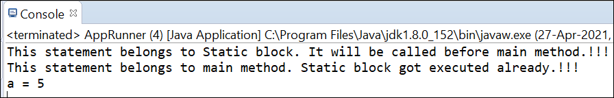

# Output:

Here if it is observed, since main method is the start of the program - **we expect main method to run first and print "This statement belongs to main method. Static block got executed already.!!!".**
But here, **static block got executed first and printed "This statement belongs to Static block. It will be called before main method.!!!"** and main method got executed post static block execution.

Same with variable _'a'_, it was declared as a static variable and expected to print _'a'_ when main method gest executed. Before main, static block got executed and variable _'a'_ is assigned with value _'5'_ and then it is printed from main method.

