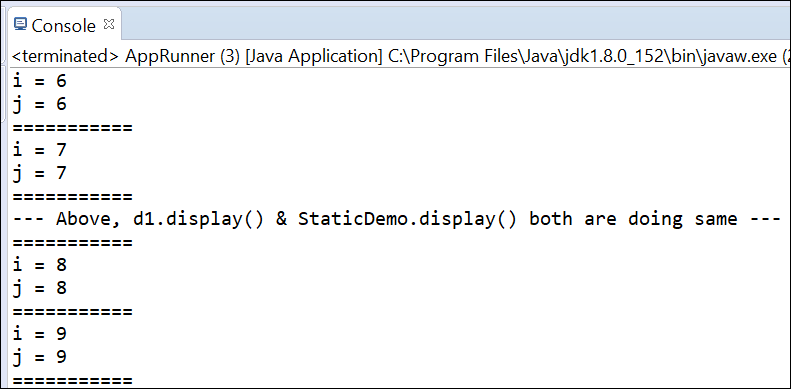
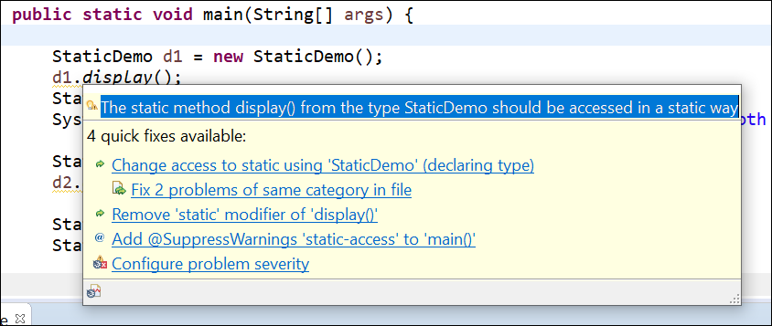

# Output:
Here it is observed that the statements **d1.display()** and **StaticDemo.display()** are giving the same output i.e. the same operation is done by both. Which means a **_static methond can be called by its ClassName or the Object of that Class_**

# Warnings: 
Do not confuse over Error and Warning. It is a convention to use ClassName for a Static Method but not mandatory.

