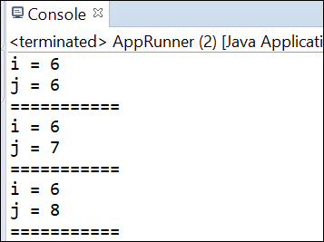

# Output:
Here it is observed that the **Instance Variable '_i_'** is being initialized everytime whenever a new object gets created,
but where as the **Static Variable '_j_'** is not being initialized everytime a new object is created but the same variable is being shared by all the objects.

